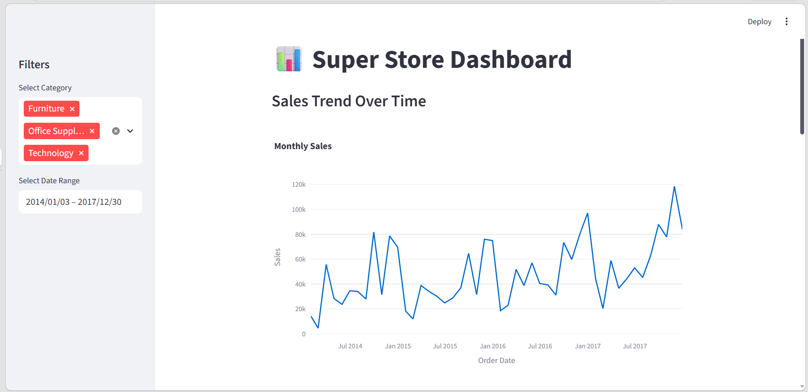

# 📊 Superstore Dashboard

An interactive Streamlit dashboard for analyzing the Superstore dataset.  
Deployed on Streamlit Cloud for easy access and sharing.

---

## 🚀 Features
- **Sales Trend Analysis**: Monthly sales visualization with trend line.
- **Profit Breakdown**: Profit by category and sub-category.
- **Customer Segmentation**: RFM analysis (Recency, Frequency, Monetary).
- **Interactive Filters**: Sidebar filters for category, region, and date range.
- **Export Option**: Download filtered data directly.

## 📸 Screenshot

## 📧 Contact
Developed by Arsal Khan  
Email: arsalannaeem11.com  
LinkedIn: (https://www.linkedin.com/in/immuhammadarsal/)

---

## 📂 Project Structure
